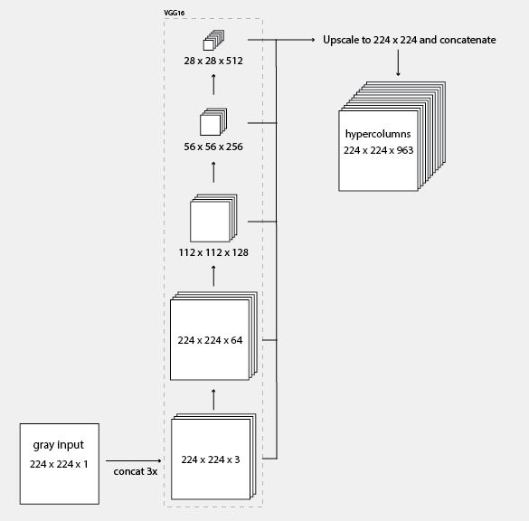

# Model Architectures
## Architecture 1: U-Net (We used this model)

The architecture of the model is symmetric, with n encoding units and n decoding units. The contracting path consists of 4 × 4 convolution layers with stride 2
for downsampling, each followed by batch normalization and Leaky-ReLU
activation function with the slope of 0.2. The number of channels are doubled
after each step. Each unit in the expansive path consists of a 4 × 4 transposed
convolutional layer with stride 2 for upsampling, concatenation with the activation map of the mirroring layer in the contracting path, followed by batch
normalization and ReLU activation function. The last layer of the network is a
1 × 1 convolution which is equivalent to cross-channel parametric pooling layer.
We use tanh function for the last layer. The number of channels in the output layer is 3 with L * a * b * color space.

> You can find the model [here](https://drive.google.com/file/d/1biUjfEqCFgmNGzGXg8yTf9vsXTsLaB39/view)

> You can find the notebook [here](https://github.com/SuperMoody/b7b_el_cima/tree/master/Notebooks/U-Net)

---
## Architecture 2: U-Net but with output of 2 layers(A and B channels only)

In this work we utilize the L * a * b * color space for the colorization task. This is because L * a * b * color space contains dedicated channel to depict the brightness
of the image and the color information is fully encoded in the remaining two channels. As a result, this prevents any sudden variations in both color and brightness through small perturbations in intensity values that are experienced through RGB. So the input of the network is L-channel and the output is the a * b channels. To show the image, we concatenate the L and the a * b channels.

> You can find the model [here](https://drive.google.com/file/d/1qkQcFkHXwDDdP2zDcef5CCU8UClI5dOe/view)

> You can find the notebook [here](https://github.com/SuperMoody/b7b_el_cima/tree/master/Notebooks/arch3)

---
## Architecture 3: 

-  Read the Description [here](https://tinyclouds.org/colorize/)

    ### Fist half:
    

    ### Second half:
    

> You can find the model [here](https://drive.google.com/file/d/1-KQmv4bV-8j8kSzYZOg5vW0RS8axDCw_/view)

> You can find the notebook [here](https://github.com/SuperMoody/b7b_el_cima/tree/master/Notebooks/arch2)

